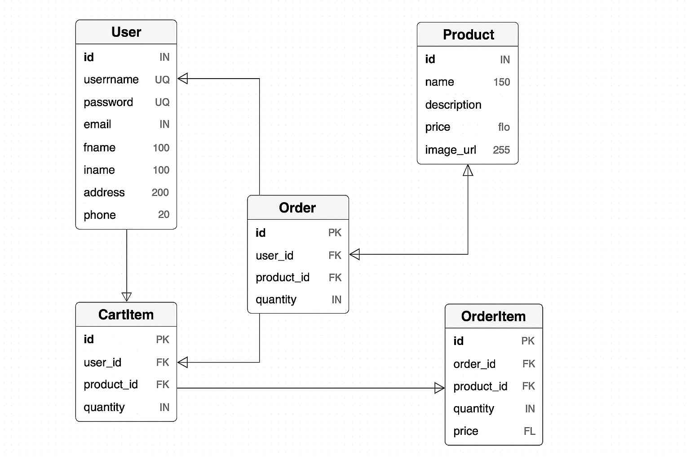

# iGo Space Travel

## Description

iGo Space Travel is a shop aimed for space adventurers who would like to explore space and get the latest space gear. iGo Space Travel brings excitement, fun and adventure on a different number of activities designed for families, team building, solo explorers or simply commute. We can't wait to have you on board.

This website is available in [Render](https://igospace.onrender.com)

## Website contents
This website includes the following pages:
- Base
- Home
- Login
- Register
- Shop
- Cart
- Checkout
- Order History
- Order Confirmation

## Technologies Used

### Languages and Frameworks
- Python
- HTML
- CSS
- JavaScript

### Backend
- Flask
- Flask-SQLAlchemy
- PostgreSQL
- Bcrypt

### Frontend
- Jinja2 (Flask templating)
- Font Awesome (icons)
- Bootstrap (for layout and responsiveness)

### Tools
- Visual Studio Code
- GitHub Desktop
- pgAdmin
- PostgreSQL

### Create Project
- Set up the Flask Environment:
  - Initialize a virtual environment by running the command: python -m venv venv
  - Activate the virtual environment on Windows: venv\Scripts\activate
  - Install Flask by running the command: pip install flask.
- Create Flask Application Files:
  - Create a new Python file named app.py
- Update Python
  - python.exe -m pip install --upgrade pip
- Install Dependencies
  - pip install Flask Flask-SQLAlchemy psycopg2-binary Flask-Bcrypt python-dotenv
- Run Application
  - python app.py

### Deploy on render
- Create an account in [render](https://render.com/) and connect to your GitHub account
- Create a New Workspace
- Create new service and select Postgres to create the database
- Create new service, select Web Services and your GitHub repository
  - Make sure your Build Command is pip install -r requirements.txt
  - Make sure your start command is gunicorn app:app
- Click the 3 dots next to your Web Service and Settings
- Click Environment under Manage
- Create a new Environment Variable with the key DATABASE_URL. You can get the values needed on the Postgres service

### Database Migrations
To update prod db when changes are made on the database schema (new tables, columns, etc)
1. Install Flask-Migrate
```bash
pip install Flask-Migrate
```
2. Initialise Migrations
```python
from flask_migrate import Migrate
migrate = Migrate(app, db)
```
2.1 Run in terminal
```bash
flask db init
flask db migrate -m "Initial migration"
flask db upgrade
```
[Flask-Migration Documentation](https://flask-migrate.readthedocs.io/en/latest/)

### Entity Relationship Diagram (ERD)
This project uses a relational database (PostgreSQL) with the following tables:
- users – Stores user information including names, email, and hashed passwords.
- products – Catalog of space gear and travel packages.
- cart_items – Tracks the user’s cart, whether logged in or a guest.
- orders – Stores completed orders and associated user.
- order_items – Links products to orders with quantity and price.

The relationships are:
- One User → Many Orders
- One Order → Many OrderItems
- One Product → Many OrderItems
- One User → Many CartItems

Visual Representation


### Reset Password (PostgreSQL + Bcrypt)
Since password reset was not developed for this app, and passwords are hashed with bcrypt, a short Python file was created to generate a new password and print the new password in hashed format when app runs
```python
from flask_bcrypt import Bcrypt

bcrypt = Bcrypt()
hashed_password = bcrypt.generate_password_hash("newPassword!").decode('utf-8')
print(hashed_password)
```
Run the SQL script:
```sql
UPDATE users SET password = 'hashed_value_here' WHERE email = 'user@example.com';
```

### Templating: Jinja2
Jinja2 is Flask’s templating engine used to embed logic in HTML.
| Feature                  | Usage                                               |
| ------------------------ | --------------------------------------------------- |
| `{{ variable }}`         | Output variables like `{{ current_user.username }}` |
| ``         | Control flow like ``    |
| ``  | Template inheritance                                |
| `url_for()`              | Generates dynamic URLs                              |
| `get_flashed_messages()` | Displays flash messages                             |

[Jinja2 Documentation](https://jinja.palletsprojects.com/en/3.1.x/templates/)

### Javascript
JavaScript handles interactivity and DOM updates.
Example uses:
- Updating the cart UI dynamically
- Form validation
- Interactive buttons
[JavaScript Documentation](https://developer.mozilla.org/en-US/docs/Web/JavaScript)

### Bootstrap
Bootstrap helps build responsive layouts with utility classes and components.
Example:
```html
<button class="btn btn-primary">Checkout</button>
<div class="row">
  <div class="col-md-6">Product Info</div>
</div>
```
To include in project:
```html
<link href="https://cdn.jsdelivr.net/npm/bootstrap@5.3.0/dist/css/bootstrap.min.css" rel="stylesheet">
```
### Font Awesome
Font Awesome provides scalable vector icons for buttons, navbars, etc.
Example:
```html
<i class="fa fa-shopping-cart"></i>
<i class="fa fa-user-circle"></i>
```
[Font Awesome Documentation](https://fontawesome.com/v5/docs/web/setup)

To include in project:
```html
<link rel="stylesheet" href="https://cdnjs.cloudflare.com/ajax/libs/font-awesome/6.5.0/css/all.min.css">
```

### Environment Variables (example for .env. Render environment variables explained above)
```python
DATABASE_URL=postgresql://'username':'password'@'host':'port'/'database'
SECRET_KEY='secretKey'
```

### Software
- Visual Studio Code
- GitHub Desktop
- pgAdmin
- PostgreSQL

### References
- [Download Visual Studio Code](https://code.visualstudio.com/download)
- [Download GitHub Desktop](https://desktop.github.com/download/)
- [Download pgAdmin](https://www.pgadmin.org/download/)
- [Download PostgreSQL](https://www.enterprisedb.com/downloads/postgres-postgresql-downloads)
- [Download Python](https://www.python.org/downloads/)
- [Flask Installation](https://flask.palletsprojects.com/en/stable/installation/)
- [Flask Quickstart](https://flask.palletsprojects.com/en/stable/quickstart/)
- [Templates in Flask](https://flask.palletsprojects.com/en/stable/tutorial/templates/)
- [SQL Alchemy - Installation Guide](https://docs.sqlalchemy.org/en/20/intro.html#installation)
- [python-dotenv 1.1.1](https://pypi.org/project/python-dotenv/)

### Images
- [Image Resizer](https://imageresizer.com/)
- [Create Logo](https://www.canva.com/)
- [Convert to favicon](https://favicon.io/favicon-converter/)
- [DeepAI - AI Image Generator](https://deepai.org/)
- [ChatGPT - AI Image Generator](https://chatgpt.com/)

### Errors
- [Import "flask_sqlalchemy" could not be resolved](https://stackoverflow.com/questions/64981804/importerror-flask-sqlalchemy-could-not-be-resolved)
- [ModuleNotFoundError: No module named 'psycopg2'](https://blog.finxter.com/fixed-modulenotfounderror-no-module-named-psycopg2/)